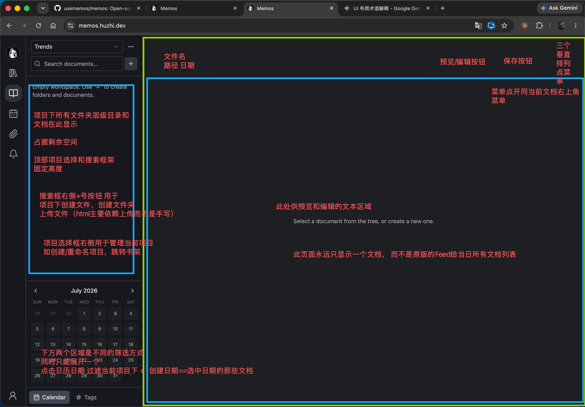
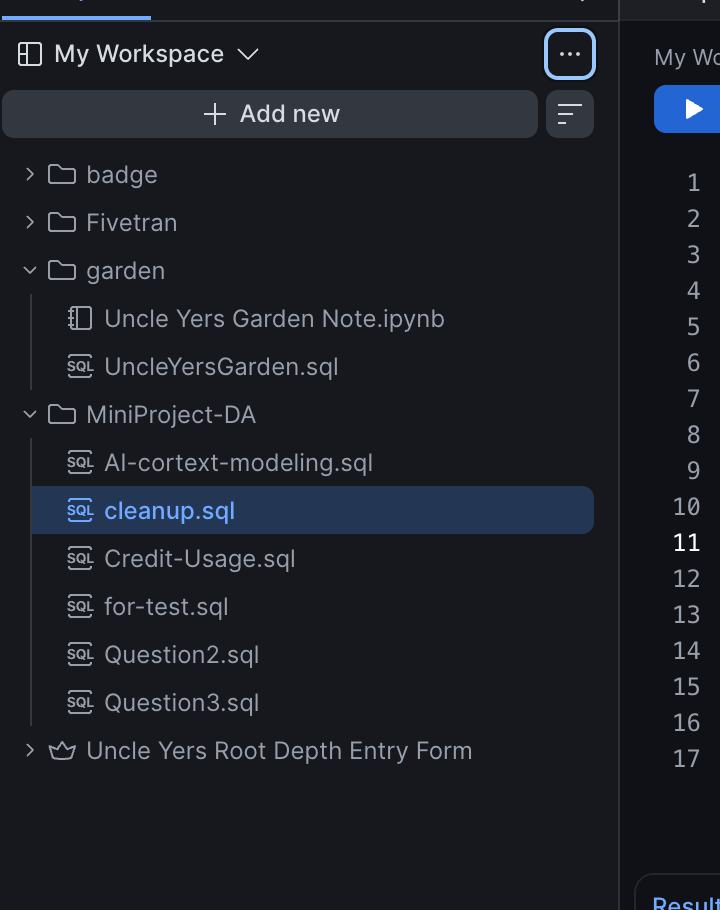

## Memos改造

这是	usememos/memos 开源项目官方fork的仓库

### 术语
下文许多地方所说的项目， 其实是知识库，之所以用项目是因为obsidian还有pycharm管理不同项目时叫项目， 但在本项目中，更确切的叫法应该是知识库

### 需求概述
现在我希望实现如下两个核心功能：

- hierarchical-notes 所有文档需要持在项目+路径下面
  - 对首页改造：日历，tags，搜索框等只是筛选器，层级文件夹才是左侧Secondary Sidebar的核心
- 支持独立的html文档渲染

### UI整体设计风格
必要时可引入与当前主题相匹配的其他UI组件，使UI设计走技术/科技感，不要使用落后的UI设计

## 需求拆解

### hierarchical-notes

#### 痛点：  
当前功能其实很有限，只有写一个一个的文档，这种场景相关替代品太多了，任意一个支持md的工具都能替代。 
实际情况下，像语雀一样有知识库+多级文件夹路径来管理 会让这个项目变得更有价值更强大。
它既不会像Notion那样需要数据库来管理多个md文档太笨重， 也不像语雀那样太多不相关内容且文档打开比较慢。  
总之，引入 项目（知识库）+文件夹层级路径，将使这个项目彻底强大起来。

#### 功能展示

除图片中给出的功能外，还需要注意以下细节：
1. 首页 需要记忆用户上次打开的项目， 下次进入首页，自动进入上次选中的项目和文档 
2. 进入首页，总是先显示预览，用户可手动切换到编辑模式
3. 右侧边区域显示md文档的outline，保存按钮右侧添加折叠按钮  如图所示。本功能只对md有效， html无该按钮无outline
4. Secondary Sidebar区域的层级文件夹设计 可以参考snowflake的workspace对文档的管理
5. 在Secondary Sidebar底部添加归档checkbox，如果选中，只显示已归档，否则只显示未归档
6. 原版memo的CRUD等API的同步升级
   - 比如，上传memo的接口必定至少需要添加一个file_path的参数 来决定文件上传的具体归属，新功能上线后不允许任何无组织文档存在（无旧数据）。

注意事项：
这个功能， 后端改动非常大， 因此必须考虑对原版memo的CRUD等API的同步升级。
这个功能的前后端改造=是本需求成功与否的关键KPI

### 书架功能
在新首页下方添加书架功能，将各个知识库以书籍样式陈列。

只做简单的陈列 

其他功能 如bookcover 换颜色等不在本次需求之列。只画书+跳转首页

### explore页面改造
项目的原首页和原Explore页面完全可以合并改造思路如下：

基本保留explore页面的所有功能（其实我感觉原首页和原explore差别非常小， 只是explore页只查看非private的文档），在此基本上，做如下实现：

1. 在Secondary Sidebar搜索框上方添加项目选择器，用户可以选项目，但不同的是，这里的文档选择器需要+选中所有项目的选项
2. 在Secondary Sidebar搜索框的底部添加 文档隐私权限的多选选择器， 可多选 private, protected, public
3. 在Secondary Sidebar搜索框的底部归档checkbox，如果选中，只显示已归档，否则只显示未归档

暂时先实现这么多，main content在这个explore页面下当前完全复用旧逻辑不做任何改动， 仅强化Secondary Sidebar区域的筛选项目 

至此， 新首页 hierarchical-notes 和 新explore页日历视图+feed 完成这两项目改造，写和查文档这块已经非常强大

### 支持HTML文档
当前AI时代， 以Claude为首的AI常常会返回Html响应， 这种文档往往能够独立运行，且传递的信息比md更有信息传递能力。因此使项目支持渲染一个个独立的html非常有必要。

需要实现的内容：
- 在新首页文本区，为html预览时，使用iframe或更新的前端技术来渲染html，webview框架注意应当和md渲染区域一样尽可能填充整个剩余main content空间
- html也支持编辑，但人工编辑的场景很少，所以只给个文本编辑器给源码即可，不需要提供特殊的html编辑支持

对html的支持，暂时只到这一层，本次需求不做太深

---

如上需求，实现后最左侧窄侧边栏 按钮顺序如下：
1. / 新首页 主要实现对层级文件夹的支持和全新的单文档预览编辑
2. /shlf 将知识库按书架的形式排列
3. /explore 主要为了尊重原创， 合并原首页和原explore， 同时做一点点体验上的提升
其他其实没啥用，暂时仅保留。

注意：重新调整上面三个左侧边栏按钮的icon，如阅读，书架，日历 分别作为新的icon来重好体现功能。

本次实现后，仍然会有很多逻辑需要闭环，比如分享public文档等等，这些需求，在下期实现。
